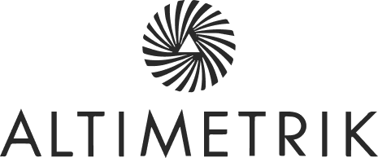

## English Standardized Test (EFSET)
**Institution:** [EFSET](https://www.efset.org/)  
**Status:** *Completed* — C2 Proficient, **78/100**  
**Year:** 2023  
**Certification:** [View Certificate](https://efset.org/cert/vdK9m4)

**Key Skills:**  
English, Language certification

**Description:**  
The EFSET is a globally recognized English proficiency test for non-native speakers, created by EF Education First. It offers a reliable measure comparable to TOEFL or IELTS.

---

## Technologist Degree in Computer Science
**Institution:** [UTEC - UDELAR](https://utec.edu.uy/en/education/undergraduate-study/technologist-degree-in-computer-science/)  
**Status:** *In course* — First two years already completed with a **GPA: 3.68/4.00**  
**Years:** 2022 - Present

**Key Skills:**  
C++, Java, MySQL, Linux, Network administration, Computer Networks, Relational Databases, Assembly, Python

**Description:**  
This degree prepares professionals to build, manage, and adapt software systems across technologies. Emphasis is placed on versatility and long-term learning over specific tools.

---

## CargoWise Certified Operator
**Institution:** [WiseTech Academy](https://wisetechacademy.com)  
**Status:** *Completed*  
**Year:** 2025  
**Certification:** [View Certificate](https://wisetechacademy.com/certificate-validation?credential=4d1b4981-5781-4594-8935-5934d359d71a)

**Key Skills:**  
Freight forwarding, Logistics operations, CargoWise, Supply chain software

**Description:**  
The CargoWise Certified Operator credential validates practical skills in using CargoWise, a leading logistics platform used by freight forwarders and supply chain professionals worldwide. It certifies the ability to navigate and operate core system functions efficiently.

---

## Become a Salesforce Developer
**Institution:** [Altimetrik Uruguay](https://www.linkedin.com/posts/altimetrikuy_salesforce-bootcamp-2023-activity-7105190139928154112-UsNM?utm_source=share&utm_medium=member_desktop)  
**Status:** *Completed*  
**Year:** 2023  
**Certification:** [View Certificate](https://www.linkedin.com/in/ignaciofern%C3%A1ndez/overlay/1704245978475/single-media-viewer/?profileId=ACoAAClJnbEBH4QPy9OzpMPGilPUGiKgzuhV-aI)

**Key Skills:**  
Salesforce, Apex, Lightning web components, REST, Unit Testing

**Description:**  
Intensive 8-week bootcamp focused on building Salesforce apps using Apex and LWC. Final project involved integrating a Heroku-hosted API for managing legal advisors and clients.

---

## Technological Middle Education
**Institution:** [ANEP - UTU](https://www.utu.edu.uy/educacion-media-tecnologica-informatica-enfasis-desarrollo-y-soporte-desarrollo-web-videojuegos)  
**Status:** *Completed*  
**Years:** 2017 - 2019 **GPA: 3.33/4.00** 

**Key Skills:**  
Java, MySQL, Relational Databases, Visual Basics, Arduino, Computer Networks, Operative Systems, Linux, PC Maintenance

**Description:**  
Technical high school program focused on programming, networking, and PC maintenance. Provided hands-on training in Java, databases, and operating systems.
